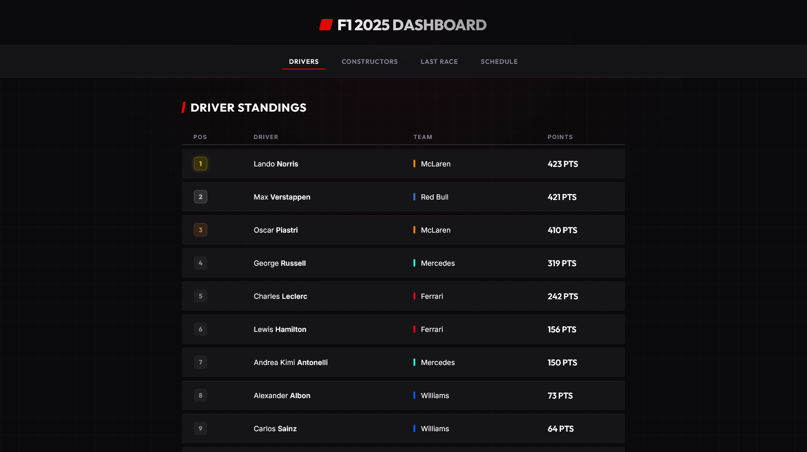

# 🏎️ F1 2025 Dashboard

A web dashboard displaying the 2025 Formula 1 season data, built with Flask and vanilla JavaScript.



## Features

- 🏆 Driver Standings
- 🔧 Constructor Standings  
- 🏁 Last Race Results
- 📅 Race Schedule 2025

## Tech Stack

- **Backend:** Python, Flask
- **Frontend:** HTML, CSS, Vanilla JS
- **Data:** [Jolpica F1 API](https://api.jolpi.ca/)

## Getting Started

### Prerequisites
- Python 3.x
- pip

### Installation

1. Clone the repository
```bash
   git clone https://github.com/USERNAMEKAMU/f1-dashboard.git
   cd f1-dashboard
```

2. Create virtual environment
```bash
   python -m venv .venv
   .venv\Scripts\activate
```

3. Install dependencies
```bash
   pip install -r requirements.txt
```

4. Run the app
```bash
   python app.py
```

5. Open browser at `http://127.0.0.1:5000`

## Screenshots


## License
MIT